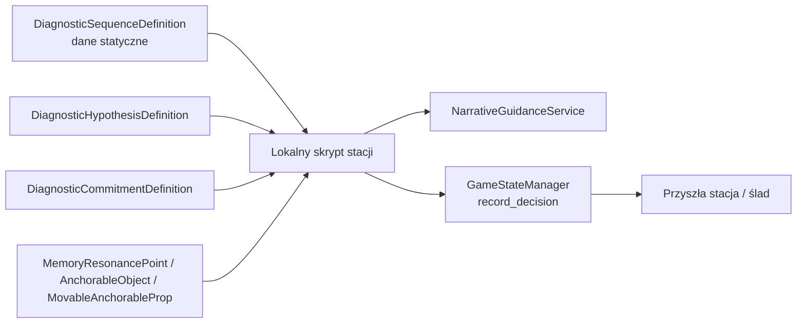

# Getting Strange — plan realizacji P7: Gameplay Depth Rebuild

Status: **AKTYWNY PLAN PRODUKCYJNY 1.0 — PKG-0144 / D-154; S08 ZAMKNIĘTY PROCEED (PKG-0145 / D-155); S01–S05 ZAMKNIĘTE AKCEPTACJĄ TECHNICZNĄ (PKG-0146 / D-156, D-157); S06–S07 ZAMKNIĘTE AKCEPTACJĄ TECHNICZNĄ (PKG-0147 / D-158, D-159); S09–S10 ZAMKNIĘTE TECHNICZNIE (PKG-0148 / D-160, D-161; final full verify PASS 716,71 s)**  
Data: 2026-08-30  
Zakres: plan migracji kampanii z liniowych aktywacji do sekwencji diagnostycznych.  
Nie jest dowodem, że nowa gramatyka będzie zabawna, zrozumiała, emocjonalnie
uczciwa ani dostępna dla nowej osoby.

## 1. Decyzja i granica pakietu

P7 realizuje kierunek `GAMEPLAY_DEPTH_VISION.md` przez autorskie sekwencje:

`rozbieżność → hipoteza → próba rozstrzygająca → zobowiązanie → ślad`.

Zmiana dotyczy argumentu gracza, a nie liczby interakcji. Stacja nie może
odblokować wyjścia tylko dlatego, że zebrano komplet punktów pamięci albo
odtworzono komplet linii dialogu. Każdy wymagany krok ma zmienić model świata,
stan relacji albo obserwowalny skutek.

PKG-0144 jest wyłącznie planem. Nie zmienia scen, skryptów, testów, geometrii,
InputMap, zapisu, eksportu ani binariów. Wdrożenie zaczyna dopiero PKG-0145.

### 1.1 Stan zastany, który plan naprawia

Świeża bramka PKG-0144 potwierdziła działający technicznie routing, powroty,
InputMap, traversal lint i 45 technicznych zasobów scenicznych. Audyt kodu
ujawnił jednak wzorzec, który P7 zastępuje:

- `MemoryResonancePoint.resonance_triggered` ustawia lokalne booleany;
- `_check_unlock()` lub analogiczna koniunkcja/alternatywa odblokowuje wyjście;
- `advance_dialogue()` w wielu stacjach sam uruchamia inspekcje i odblokowuje
  dalszą drogę;
- istniejące Anchor/Yield, zgody i trwałe ślady są najczęściej dialogiem,
  test-hookiem albo pojedynczą flagą, nie argumentem wykonywanym przez gracza.

`FULL_STORY.md`, `NARRATIVE_BIBLE.md` i `CONTINUITY_TRACKER.md` pozostają
normatywnym opisem tego, co kampania ma znaczyć. Aktualny runtime jest materiałem
migracji, nie argumentem za zmianą kanonu na legacy.

## 2. Model kampanii: 43 adresy, 45 zasobów

W dokumentach P7 stosujemy dwa rozłączne pojęcia:

| Pojęcie | Liczba | Definicja |
|---|---:|---|
| Adres narracyjny / przebieg | 43 | Station 01–41, dokładnie jeden z wariantów 42A/42B/42C oraz Station 43. |
| Techniczny zasób sceniczny | 45 | Pliki Station 01–41, 42A, 42B, 42C i 43. |

Pojedynczy przebieg nigdy nie odwiedza wszystkich trzech wariantów 42. Plan
używa oznaczenia `42X`, gdy kontrakt obejmuje wybraną rodzinę finału, a nie trzy
równoległe wizyty.

## 3. Nienaruszalne inwarianty P6 i kanonu 0.3

| Inwariant | Kontrakt P7 | Późniejszy dowód techniczny | Czego dowód nie powie |
|---|---|---|---|
| Godot-only | Nie powstaje web, PWA, Git ani nowa dystrybucja. | `tools/verify.ps1`, kontrola plików pakietu. | Nic o jakości gry. |
| 640×360, 60 Hz, semantyczny InputMap | P7 używa istniejących akcji; nie dodaje czasownika ruchu ani klawisza dla kotwicy. | `project.godot`, smoke, kontrakty wejścia. | Nic o ergonomii. |
| D-099 i próg 18 px | Próba jest dowodem w świecie, nie torem zręcznościowym. Przenoszenie, kotwiczenie i infrastruktura nie wymagają timingu klatkowego. Ponad 18 px tylko istniejąca/uzasadniona drabina albo winda. | traversal lint, geometry audit, przejście stacji. | Nic o odczuwanej trudności. |
| Pixel-Stage i ostry tekst | Stan A/B, koszt, źródło i zgoda są czytelne bez koloru; tekst pozostaje nad kompozytorem w 640×360. | test warstw, capture normal/reduced. | Nic o rozumieniu kadru. |
| ReturnZone i backtrack | Każda migrowana stacja zachowuje wejście w lewo i bezpieczny spawn z prawej. | test topologii i player-verb traversal. | Nic o orientacji nowej osoby. |
| Reduced motion | Ruch pola, korekcji i śladu redukuje amplitudę, nigdy nie usuwa faktu ani kosztu. | capture par normal/reduced, test `MotionAccessibility`. | Nic o komforcie przedsionkowym. |
| Brama 21 | `world_recognized` powstaje wyłącznie po syntezie próbki, publicznej biografii i dowodu relacyjnego. | test sekwencji 18–21 i stanu zapisu. | Nic o sile zwrotu. |
| Brama 22 | Przed 22 nie ma świadomego Anchor/Yield ani znanego kosztu metody. Koszt poznaje się dopiero po próbie na martwym obwodzie. | test strażników stanu oraz kolejności zdarzeń. | Nic o satysfakcji odkrycia. |
| Autonomia Marty i Jakuba | Zgoda ma zakres, ryzyko i alternatywę; odmowa tworzy uczciwy stan, nie karę ani punkty moralne. | test danych decyzji, dostępnych dróg i braku ukrytego rankingu. | Nic o emocjonalnej wiarygodności dialogu. |
| Trzy rodziny finału | 42A, 42B i 42C pozostają wymuszeniem powrotu, zamknięciem Równi i przejściem wzajemnym; 43 pokazuje stan obu Len, obu relacji Marty, Jakuba, UCP/Wierzbickiej i publicznego śladu. | test routingów, warunków i matrycy epilogu. | Nic o tym, czy koszty są odbierane jako równoważne. |

## 4. Dwa odrębne kontrakty: fakt i zobowiązanie

### 4.1 Zagadka faktu

Zagadka faktu pyta, co jest prawdą o układzie. Ma jeden uczciwie sprawdzalny
wynik, ale nie musi wymagać jednego fizycznego wejścia:

1. Każdy niezbędny wniosek ma dwa niezależne konteksty; co najmniej jeden daje
   możliwość sprawdzenia, a nie tylko dekorację.
2. Hipoteza zawiera przewidywanie obserwowalnego wyniku. Gracz nie zgaduje
   intencji autora ani nie wybiera odpowiedzi w quizie.
3. Próba rozstrzygająca odróżnia przynajmniej dwie hipotezy przez zmianę
   materiału, infrastruktury, rekordu lub relacji źródeł.
4. Błędna bezpieczna próba zostawia nowy fakt albo zawęża model. Nie usuwa
   obowiązkowej poszlaki, nie odtwarza długiego dialogu i nie tworzy softlocka.
5. L3 wskazuje test rozróżniający, a L4 może nazwać czynność i powód. Żaden
   poziom guidance nie wybiera hipotezy, zgody ani finału za gracza.

### 4.2 Zobowiązanie etyczne

Zobowiązanie pyta, co wolno zrobić po poznaniu faktu. Nie ma ukrytej odpowiedzi
optymalnej, moralnego licznika ani bezkosztowego wariantu:

1. Przed decyzją scena pokazuje zakres osoby, ryzyko działania i konkretny koszt
   każdej dostępnej drogi.
2. Zgoda jest przypisana do osoby, zasobu, czasu i celu. Nie może wynikać z
   domyślnej flagi, automatycznego dialogu ani braku sprzeciwu.
3. Odmowa, zgoda ograniczona i zgoda udzielona są osobnymi stanami działania.
   Każda dopuszczalna odmowa prowadzi do uczciwej alternatywnej drogi, a nie do
   kary lub niedostępnego finału.
4. Wartość nie jest redukowana do jednego numeru. Ślad pozostaje w konkretnej
   pamięci, adresie, rejestrze, infrastrukturze albo późniejszej relacji.

## 5. Granice architektury i danych

P7 rozszerza dane oraz lokalne autorstwo. Nie wprowadza globalnego menedżera
zagadek, ekwipunku kotwic ani równoległego save systemu.

### 5.1 Komponenty zachowane, adaptowane i nowe

| Element | Status | Właściciel po migracji | Kontrakt P7 |
|---|---|---|---|
| `GameStateManager` i JSON `decisions` | KEEP / ADAPT | istniejący autoload | Pozostaje jedynym właścicielem trwałych faktów i decyzji. Obecne API przyjmuje dowolny `Variant`, więc PKG-0145 dodaje rekursywną bramę JSON w `record_decision()`: dozwolone są tylko JSON-owe prymitywy, tablice i słowniki; Node, Resource i Callable są odrzucane bez mutacji stanu. |
| `MemoryResonancePoint` | ADAPT | lokalny skrypt stacji | Nadal emituje badanie obiektu i kontakt, ale jego sygnał nie jest sam z siebie punktem zaliczenia. Stacja interpretuje go jako obserwację, materiał próby albo ślad. |
| `NarrativeGuidanceService` i `GuidanceBeat` | KEEP / ADAPT | lokalna stacja | Istniejące L0–L4, cooldown, supresja dialogu i zamykanie hipotez służą każdej migracji. Po 22–43 mają obowiązkowo obsłużyć hipotezę i próbę, nie tylko L1. |
| `AnchorableObject` i `AnchorResonance` | KEEP / ADAPT | lokalna stacja | Stan A/B, `apply_reality_shift()`, odporność i sygnały są jedyną ścieżką zmian Anchor/Yield. Bez bezpośredniego zapisu `current_reality`. |
| `MovableAnchorableProp` | KEEP / ADAPT | lokalna stacja | Pchanie i ciężar służą wyłącznie fizycznemu argumentowi próby; nie tworzą platformingu ani trasy skoków. |
| `AnchorLab` | ADAPT | prototyp źródłowy | Reguła jednej aktywnej kotwicy zostanie wydzielona do lokalnego kontrolera stacji, zamiast kopiowania logiki prototypu. |
| `ReturnZone`, `AirlockZone`, `StationCameraRig`, `MotionAccessibility` | KEEP | istniejąca infrastruktura | Nie są przepisywane przez P7. Każda migracja zachowuje przejście, spawn, kadr i tryb ograniczonego ruchu. |
| `DiagnosticSequenceDefinition` | NEW | zasób autorski `Resource` | Dane jednej sekwencji 2–4 adresów: identyfikator, adresy, wejściowe bramy, rozbieżność, wymagane źródła, hipotezy, próba, zobowiązania, ślad, beats guidance, klucze stanu i rewizja migracji. |
| `DiagnosticHypothesisDefinition` | NEW | subresource sekwencji | Id, fakt źródłowy, przewidywanie, dowody wymagane, wynik próby oraz identyfikator zamknięcia. Nie zawiera tekstu, który stwierdza poprawną odpowiedź zamiast świata. |
| `DiagnosticCommitmentDefinition` | NEW | subresource sekwencji | Id, osoba/zakres, znany koszt, wymagane ujawnienie, dopuszczalna alternatywa, zapis wyniku i ślad. Nie posiada pola „moral score”. |
| `AnchorExclusivityController` | NEW, lokalny | tylko stacja z polem ciągłości | Ma dokładnie jedną aktywną kotwicę w obrębie sceny, zwalnia poprzednią i emituje zmianę. Nie jest autoloadem, nie przechowuje kampanii i nie tworzy inventory. |

### 5.2 Przepływ odpowiedzialności



- Zasób opisuje kontrakt, nie wykonuje sceny.
- Lokalny skrypt stacji prowadzi fizyczny test, sprawdza lokalne warunki i
  rejestruje wynik tylko przez publiczne API `GameStateManager`.
- `GameStateManager` zapisuje fakty oraz decyzje, ale nie interpretuje ich jako
  logiki zagadki i nie wywołuje odblokowań poza istniejącym routingiem kampanii.
- Prezentacja słucha sygnałów i stanu; nie modyfikuje danych gry.

### 5.3 Konwencja stanu i migracja save

Nowe trwałe dane P7 używają stabilnych kluczy `StringName`:

`p7.<sequence_id>.<fact_lub_decyzja>`.

Przykłady: `p7.mutual_test.dead_circuit_cost`,
`p7.mutual_test.marta_boundary`, `p7.mutual_test.ucp_buffer_trace`.

Każda sekwencja ma własną `migration_revision`. Pierwsza implementacja P7:

1. zachowuje `SAVE_SCHEMA_VERSION = 1`, ponieważ istniejący słownik `decisions`
   jest rozszerzalny; PKG-0145 przed `JSON.stringify()` zapewnia przez
   `record_decision()` rekursywną walidację wartości JSON-safe;
2. dopisuje własną rewizję P7 do `decisions`, nie tworzy drugiego pliku save;
3. nigdy nie wyprowadza nowej zgody, faktu ani kosztu z legacy booleana;
4. przy zapisie z checkpointem wewnątrz migrowanej sekwencji resetuje tylko
   lokalny postęp tej sekwencji do jej bezpiecznego adresu wejściowego, zachowując
   fakty z wcześniejszych sekwencji oraz ustawienia użytkownika;
5. utrzymuje tymczasową listę ignorowanych legacy kluczy wyłącznie przez okres
   migracji danej sekwencji, po czym usuwa wszystkich jej callerów i stare
   automatyczne odblokowania w tym samym pakiecie.

To jest clean cutover: żaden nowy kontrakt nie zależy od `set_campaign_flag`
(nieistniejącego API), automatycznego `advance_dialogue()` ani preselected
`APPARENT_COOPERATION`.

### 5.4 Długi legacy, które muszą zniknąć w odpowiednich falach

| Zakres | Potwierdzony dług | Wymagany cutover |
|---|---|---|
| 01–14 | OR/AND checklisty, martwe wywołania `set_campaign_flag`, przedwczesne nazwisko Wierzbickiej w Station 12 | Lokalna diagnoza zamiast checklisty; stan canonicalny; Station 12 używa bezosobowego „UCP” do Station 16. |
| 15–21 | Synteza Station 21 jest najbliższym wzorcem trzech źródeł, ale nadal używa slotów/checkmarków | Zachować trzy rodziny dowodu i bramę; wymienić mechanikę na rozstrzygający model bez przedwczesnego języka. |
| 22–30 | Anchor/Yield nazwane bez mechaniki; Station 24 ma inputless enum; dialogi autozaliczają inspekcje; `run_witness_relay_correction_pass()` omija `apply_reality_shift()` | Wykonać realny test A/B, jawny koszt i zgodę; używać wyłącznie `apply_reality_shift()`; po 24 nie pozostawić domyślnej „pozornej współpracy”. |
| 31–38 | UCP, zgody i ślady są przeważnie linią dialogu; canonicalne klucze trackera rozchodzą się z `sXX_*` | Zbudować kontrmodel z niezależnego zapisu, skutku materialnego i zgody; zapisywać klucze kanoniczne oraz widoczny ślad. |
| 39–43 | Metoda jest kliknięciem A/B/C, finały i epilog nie są pochodną stanu | Metoda jest wykonanym testem; rodzina finału wynika z zobowiązania; 43 odczytuje stan osób bez sekretnej hierarchii. |

## 6. Mapa migracji kampanii — 15 sekwencji

Każdy wiersz jest planem przyszłego autorstwa, nie opisem już wdrożonego
runtime. `Źródło` wskazuje kanoniczny fakt, z którego sekwencja ma wynikać.
„Oddech” jest świadomą aktywną doliną: konsoliduje koszt, źródło lub relację,
ale nie dodaje sztucznej poszlaki.

| ID i adresy | Rozbieżność oraz hipotezy robocze | Próba rozstrzygająca | Zobowiązanie i ślad | Oddech / źródło | Bramki i D-099 |
|---|---|---|---|---|---|
| S01 `01–03` Próbka i obietnica | Trzysekundowa luka mimo działającego pomiaru; hipotezy: błąd czujnika, błąd mocowania, prawidłowy surowy odczyt. | Powtórzyć pomiar po sprawdzeniu mocowania i porównać surowy zapis z czasem przejazdu. | Lena zachowuje próbkę i informuje Martę o opóźnieniu zamiast ukrywać sam fakt opóźnienia; ślad: próbka i wiadomość z czasem. | 03 jest rozmową/oddechem. `FULL_STORY` 01–03. | 01–05 pozostają zwyczajne; bez języka innego świata i bez Anchor/Yield. Brak nowej geometrii. |
| S02 `04–05` Powrót pod kontrolą | Czytnik powtarza lukę podczas zwykłego przejazdu; hipotezy: cache czytnika, lokalny błąd odczytu, powiązanie z próbką. | Odczytać powtórkę bez zmiany trasy i skonfrontować ją z niezależnym zegarem/ruchem wagonu. | Lena odkłada czytnik, lecz zabezpiecza jego stan do późniejszego porównania; ślad: odnotowana powtórka bez paranormalnej interpretacji. | 05 jest świadomą ulicą-oddechem. `FULL_STORY` 04–05. | Nadal normalność; infrastruktura tramwaju wykonuje swoją pracę, nie jest torem timingowym. |
| S03 `06–08` Rozkład, numer, adres | Papier, offline i adres nie zgadzają się; hipotezy: cache, zmieniona numeracja, rekord przypisany innemu życiu. | Porównać papierowy rozkład z publicznym nośnikiem i sprawdzić, czy domofon rozpoznaje dokument, ciało czy adres. | Lena próbuje kontaktu bez podszywania się pod cudzą biografię; ślad: zestaw zgodnych i sprzecznych identyfikatorów. | Rozmowa przy domofonie jest oddechem przed progiem. `FULL_STORY` 06–08. | Przed 21 bez „miejscowej Leny”; żadnych kodów-escape-roomów, tylko działający domofon/rejestr. |
| S04 `09–11` Próg cudzej codzienności | Sąsiadka i klucz rozpoznają Lenę, lecz jej pamięć i fotografia opisują inne życie; hipotezy: remont/renumeracja, intruz, utracona relacja. | Zestawić fizyczne zużycie klucza, nieprowadzące pytanie sąsiadce oraz prywatny materiał w mieszkaniu. | Lena może przesunąć realny przedmiot, by bezpiecznie wejść, ale nie traktuje prywatnej rzeczy jak wolnego dowodu; ślad: obcy adres i fotografia. | 11 pozwala badać domowe ślady bez dalszego alarmu. `FULL_STORY` 09–11. | `MovableAnchorableProp` jest ciężarem R4, nie platformą; brak świadomego Anchor/Yield. |
| S05 `12–14` Głos, dokument, granica | Wiadomość Marty, dwa dokumenty i jej obecność nie pasują do wygodnej wersji „pomyłki”; hipotezy: staging, różne daty, luka pamięci. | Porównać szczegół, którego rozmówca nie może zasugerować: godzinę, sprzęt i położenie klucza. | Lena prosi o niezależny opis i respektuje próg Marty; ślad: jawna różnica relacji, nie domyślna zgoda. | 12 to odsłuch, 14 rozmowa jako aktywny oddech. `FULL_STORY` 12–14. | Station 12 mówi o UCP bez nazwiska Wierzbickiej; brak przedwczesnego rozpoznania. |
| S06 `15–17` Pamięć i zapis pracy | Wspólna wyprawa ma inny skutek, a instytucjonalna historia trwa miesiącami; hipotezy: manipulacja pamięcią, fałszywy zapis, spójna obca biografia. | Porównać historię terenową, biometrykę i log audytu, aby odróżnić jednorazową ingerencję od trwałej chronologii. | Lena kopiuje raport tylko w zakresie koniecznym do testu, nie używa prywatnych danych Marty jako skrótu; ślad: źródło instytucjonalne i sprzeczność dokumentów. | Krótka praca z raportem po próbie konsoliduje model. `FULL_STORY` 15–17. | Przed 21 hipotezy pozostają ziemskie; guidance może być omylne, mechanika nie. |
| S07 `18–21` Trzy dowody miejsca | Publiczne rekordy, żywy Jakub i próbka nie mieszczą się w fałszerstwie; hipotezy: kopia błędu, oszust, spójna obca ciągłość. | Fizycznie zestawić próbkę/czytnik, lokalną biografię i relacyjny dowód Jakuba; każdy unieważnia inną prostszą hipotezę. | Przyjąć wynik faktu oraz wspólny cel znalezienia osoby, której szuka Marta; ślad: `world_recognized` i `local_lena_search_committed`. | 19 daje rozmowę przed syntezą. `FULL_STORY` 18–21. | Tylko 21 wypowiada „To nie jest mój świat”; nie daje wiedzy o metodzie ani koszcie. |
| S08 `22–25` Sygnał, martwy obwód, granica, ślad | Dwa zachowania sygnału i oferta UCP nie rozstrzygają, czy istnieje odpowiedź czy echo; hipotezy: echo urządzenia, sąsiedni stan, ślad miejscowej Leny. | 23 wykonuje odwracalną próbę A/B na martwym obwodzie: Anchor utrzymuje relację kosztem sąsiedniego odczytu, Yield dopuszcza odpowiedź kosztem ostrości śladu. | 24 Marta po pełnym ujawnieniu ryzyka udziela ograniczonego dostępu albo odmawia użycia notatek; 25 daje uczciwą techniczną drogę po odmowie. Ślad: koszt próby, zakres Marty i bufor interwencji UCP. | 24 jest relacyjną doliną po technicznej próbie. `FULL_STORY` 22–25. | Pierwszy świadomy Anchor/Yield dopiero po 21; dokładna karta wycinka w §8. Bez ruchu, HUD-u i timingów. |
| S09 `26–28` Przerwana próba i mały koszt | Log UCP przeczy czasowi próbki, a odpowiedź może być echem; hipotezy: własne echo, żywy sygnał, późniejsza interwencja UCP. | Synchronizować trzy zegary, potem wysłać dwa identyczne impulsy i trzeci z celowym błędem; odpowiedź ma skorygować wyłącznie błąd. | Anchor jednego śladu albo Yield wspólnego dryfu po pokazaniu ceny; ślad: `ucp_intervention_reconstructed`, `local_lena_signal_confirmed`, `small_cost_manifested`. | 27 jest słuchaniem odpowiedzi, 28 odczytem ceny. `FULL_STORY` 26–28. | Jedna lokalna kotwica; błąd daje informację, nie reset. Koszt dotyczy pamięci/adresu, nie punktów. |
| S10 `29–30` Granica Jakuba i prognozy | Sygnał Jakuba daje najlepszy kierunek, ale jego życie nie jest parametrem; hipotezy: bezkosztowy skrót, ograniczone świadectwo, trasy bez jego sygnału. | Zbudować trzy prognozy z aktualnych danych i sprawdzić, które pole zależy od dokładnie nazwanego zakresu zgody. | Jakub wybiera `granted`, `limited` albo `refused`; każda droga zachowuje uczciwy dalszy argument. Ślad: `jakub_consent_state`, `route_hypotheses_mapped`, jawne braki danych. | 30 jest aktywną analizą po granicy Jakuba. `FULL_STORY` 29–30. | Prognozy nie są wyborem finału ani A/B/C menu; bez ukrytej moralności. |
| S11 `31–33` Kontrmodel archiwum | UCP oferuje stabilność, lecz krzesła, szkło i abort-note nie pasują do jej neutralnego modelu; hipotezy: korekta chroni wszystkich, selektywnie usuwa świadectwo, miejscowa Lena działała bez zgody obu stron. | Złożyć kontrmodel z materialnego śladu, niezależnego rejestru i warunku przerwania miejscowej Leny. | Zachować ślad albo przyjąć instytucjonalny zapis z jawną stratą dostępu; ślad: `local_lena_intent_found` oraz widoczne korekcje materiału. | Archiwum 31 pozwala czytać wynik przed szybkim wnioskiem. `FULL_STORY` 31–33. | UCP jest przewidywalną procedurą, nie bossem; AnchorableObject używa pełnego API A/B. |
| S12 `34–36` Para kosztów | Rejestr par, echo domu i katastrofa Linii 4 przeczą prostemu swapowi; hipotezy: jedno ciało zamienione, powiązane ciągłości, świadomy eksport kosztu. | Porównać identyfikatory par, ograniczone echo domu i rejestr kosztów UCP w trzech niezależnych kontekstach. | Ujawnić cenę osobom zanim wykorzysta się ją jako metodę; ślad: `home_echo_verified`, `ucp_cost_ledger_found`, widoczna zmiana stanowiska UCP. | 35 jest krótkim oglądem domu bez miejscowej Leny. `FULL_STORY` 34–36. | Winda/drabina pozostają funkcją infrastruktury; bez skoku jako lokomocji. |
| S13 `37–38` Świadectwo i warunek przerwania | Najsilniejsza ścieżka używa Jakuba, a Marta ma własną granicę wobec procedury; hipotezy: pełne ujawnienie, ograniczona współpraca, niezależna droga bez ich zasobów. | Sprawdzić minimalny, kontrolowany udział przy świadomym wyłączniku Jakuba i pełnej informacji dla Marty. | Zgoda Jakuba i prawda dla Marty mają jawny zakres; ślad: `jakub_consent_state`, `marta_truth_state` oraz stan obiektu ratunkowego. | Rozmowa po próbie pozwala osobom zmienić stanowisko bez kary. `FULL_STORY` 37–38. | Nie ma „empatycznie poprawnej” odpowiedzi; `full/partial/withheld` opisuje informację, nie punkty. |
| S14 `39–41` Metoda wykonana, nie wybrana | Trzy metody chronią różne wartości, a UCP faworyzuje jedną stabilność; hipotezy dotyczą skutków, nie prawdziwości faktu. | Wykonać testy obciążenia na zgromadzonych faktach i zgodach; każde pole prognozy pokazuje, co pozostaje nieznane. | Lena wiąże jedną metodę po obejrzeniu kosztów; ślad: `method_committed`, rodzina końca wynika z wykonanej metody, a `ending_stability` z wcześniejszych stanów. | 39 jest stołem braków, 41 weryfikuje wynik działania. `FULL_STORY` 39–41. | Nie używać listy A/B/C jako substytutu działania; bez sekretnego czwartego finału. |
| S15 `42X–43` Skutek osób | Żadna metoda nie odzyskuje jednocześnie wszystkich osób, adresów i pewności. | Wykonać wybraną metodę oraz sprawdzić materialny, relacyjny i publiczny wynik, zanim rozpocznie się epilog. | Zobowiązanie jest nieodwracalne, ale jawne; ślad: konkretne stany obu Len, dwóch Marty, Jakuba, Wierzbickiej/UCP i publicznego rejestru w 43. | 43 jest oddechem po działaniu, nie wykładem kosmologii. `FULL_STORY` 42A–43; `NARRATIVE_BIBLE` §16. | Jedno 42X na przebieg; trzy rodziny bez goldenu i bez zmiany autonomii postaci. |

## 7. Fale implementacji po wycinku

| Pakiet | Zakres | Warunek wejścia | Wynik wymagany przed kolejną falą |
|---|---|---|---|
| PKG-0145 | S08, Station 22–25 | Plan PKG-0144, świeża baza, D-154. | **ZAMKNIĘTY — PROCEED (2026-08-30, D-155).** Wycinek dostarczył kompletny argument 22–25: rozbieżność sygnału, dwie hipotezy, próba A/B przez `apply_reality_shift()` z lokalną wyłącznością kotwicy, jawna granica Marty (limited/declined, bez `APPARENT_COOPERATION`), droga techniczna po odmowie i trwały ślad bufora UCP (`paired_with_notes` / `technical_route`). Dane w `DiagnosticSequenceDefinition` + subresource'y; `record_decision()` jako brama JSON-safe; migracja `p7.mutual_test` rewizji 1. Werdykt mierzalny: struktura informacji, stan, koszt, alternatywa, trwałość, brak softlocka i brak regresji P6/D-099; bez dowodu odbiorczego (H-029/H-030). |
| PKG-0146 | S01–S05, Station 01–14 | PKG-0145 = PROCEED albo zatwierdzony PIVOT z zachowaniem kontraktów. | **ZAMKNIĘTY — AKCEPTACJA TECHNICZNA (2026-08-30, D-156/D-157).** Wczesne rozbieżności mają testy, canonicalne fakty i nie naruszają słownika przed 21. |
| PKG-0147 | S06–S07, Station 15–21 | Spójne dane wczesne oraz migracja trzech źródeł. | **ZAMKNIĘTY — AKCEPTACJA TECHNICZNA (2026-08-30, D-158/D-159).** S06 (`work_history_and_record`): notatki i dwa konkrety wyprawy, obserwacja zabezpieczonego telefonu, próba instytucjonalna (biometryka + numer karty + historia aktywności) i jawny minimalny zakres kopiowania raportu; Marta nie jest skrótem przez prywatne dane. S07 (`three_place_proofs`): próba publiczna (rejestr miejski + szpitalny + numer sprawy), próba głosowa (dwa pytania kontrolne; ujawnienie teorii to bezpieczny błąd), próba relacyjna (przyjęta odmowa blizny + dobrowolny skan + lokalna baza) i Station 21 z JAWNĄ syntezą trzech rodzin — trzecie ułożenie jej nie uruchamia; `world_recognized` i `local_lena_search_committed` powstają wyłącznie po syntezie, kadr nie ujawnia rozpoznania przed próbą, a kanoniczne `world_recognized` otwiera Station 22 bez ręcznej flagi. Migracja S06/S07 wymazuje legacy rozpoznanie i dowody, wraca do wejścia sekwencji i nie ustanawia kosztu metody przed S08. Werdykt mierzalny: struktura informacji, stan, koszt, alternatywa, trwałość, brak softlocka i brak regresji P6/D-099; bez dowodu odbiorczego (H-032). |
| PKG-0148 | S09–S10, Station 26–30 | Prawidłowy kontrakt kotwicy, kosztu i odmowy z 22–25. | **ZAMKNIĘTY — AKCEPTACJA TECHNICZNA (2026-08-30, D-160/D-161), final full verify PASS (716,71 s).** S09 (`interrupted_trial_and_small_cost_sequence`, 26–28): trzy zegary, dwa identyczne impulsy + trzeci z celowym błędem korygowany wyłącznie przez odpowiedź, jawna rekonstrukcja, Anchor/Yield przez `apply_reality_shift()` z lokalnym `AnchorExclusivityController` i kosztami `marta_first_meeting_detail_blurred` / `sample_exact_second_lost`. S10 (`jakub_boundary_and_forecasts_sequence`, 29–30): jawny zakres/ryzyko/koszt, wyłączony nadajnik Jakuba, `granted|limited|refused`, trzy JSON-safe forecasty i jawne porównanie, odmowa kontynuowalna. Kanoniczne `ucp_intervention_reconstructed`, `local_lena_signal_confirmed`, `small_cost_manifested`, `jakub_consent_state`, `route_hypotheses_mapped`; migracja checkpoint 26 i 29; stacje 31–43 bez zmian. Werdykt mierzalny: target gates i normal-driver capture; odbiór bez dowodu (H-033). |
| PKG-0149 | S11–S13, Station 31–38 | P7 state/migration działa na sekwencjach pośrednich. | **ZAMKNIĘTY — AKCEPTACJA TECHNICZNA (2026-08-30, D-162).** S11 (`archive_countermodel_sequence`, 31–33): materialny depozyt, 12. krzesło Jakuba, odrzucenie oferty adaptacji, pamięć materiału i ślad kondensacji (`ObservedGlassTrace`), rekonstrukcja intencji miejscowej Leny (`DualWitnessFrame` A/B) i kanoniczny fakt `local_lena_intent_found`. S12 (`pair_cost_and_echo_sequence`, 34–36): rdzeń korelacyjny, wskaźnik termiczny, odblokowanie rejestru par, baseny sedacyjne, echo powrotne Jakuba (`home_echo_verified`), drenaż dielektryczny i rejestr kosztu UCP (`ucp_cost_ledger_found`). S13 (`consent_and_rescue_boundary_sequence`, 37–38): mostek żywego sygnału, zestrojenie anteny, łącznica Jakuba, lina ratunkowa (`JakubRescueBulkhead` A/B) i ujawnienie prawdy Marcie (`marta_truth_state` = `full|partial|withheld`, bez kary i bez moralnego rankingu). Migracja checkpointów 31, 34, 37; likwidacja legacy kluczy; L0–L4 guidance z omylnymi hipotezami. Werdykt mierzalny: target gates i normal-driver capture (H-034). |
| PKG-0150 | S14–S15, Station 39–43 | Wszystkie wymagane fakty, koszty i zgody istnieją. | **ZAMKNIĘTY — AKCEPTACJA TECHNICZNA (2026-08-30, D-163).** S14 (`branch_clarity_and_irreversible_choice_sequence`, 39–41): stół metod A/B/C i rdzeń referencyjny, sala negocjacyjna poziomu 0 (Wierzbicka, Marta, Jakub, Szymon, matryca kosztów), komora wyboru operacyjnego z fizycznym załączeniem konsoli A/B/C (`final_branch_chosen` = `branch_a|branch_b|branch_c`) i trwałym śladem `method_committed_to_branch`. S15 (`conscious_silence_and_presence_sequence`, 42A–43): komory finałowe 42A (domowy pokój, dwa kubki), 42B (próg mieszkania 14, zamknięcie Równi), 42C (tory tramwajowe, równoległa obecność) oraz epilog w Station 43 utrwalający stan sześciu podmiotów w przestrzeni miejskiej (`epilogue_witness_completed` = true, ślad `conscious_silence_and_presence_witnessed`). Migracja checkpointów 39 i 42A; likwidacja legacy tokenów; L0–L4 guidance. Werdykt mierzalny: target gates i normal-driver capture (H-035). |
| PKG-0151 | Pełny P7 audit, przejście 01–43, regresja save/capture | Wszystkie sekwencje zaimplementowane. | **ZAMKNIĘTY — ZAMKNIĘCIE P7 / OTWARCIE P8 (2026-08-31, D-164).** `tests/pkg_0151_smoke_test.gd` potwierdził komplet 15 sekwencji, 45 scen technicznych, wyjątek grafu S08/S09, routing finałów A/B/C, migracje checkpointów i round-trip faktów końca. `tools/verify.ps1` przeszedł PASS z nową bramką. `tools/capture_pkg_0151.gd` + `tools/diff_pkg_0151_capture.gd` potwierdziły 36 reprezentatywnych kadrów (18 stanów × normal/reduced), wszystkie 640×360, niepuste i rozróżnialne. Werdykt pozostaje techniczny: brak dowodu odbioru człowieka; P8 wraca do readiness release bez prawa do nowych `.exe` bez jawnej zgody właściciela. |

Każda fala pozostaje mega-pakietem tylko wtedy, gdy obejmuje pełną sekwencję z
kodem, testem kontraktu, capturem po zmianie wizualnej, dokumentacją, pełnym
`tools/verify.ps1` i snapshotem. Nie wolno uznać kolejnej stacji za migrowaną
na podstawie samego tekstu lub instancji sceny.

## 8. PKG-0145 — pionowy wycinek S08 / Station 22–25

### 8.1 Dlaczego właśnie ten zakres

Station 22–25 zawiera najwcześniejszy punkt, w którym gra musi jednocześnie
udowodnić cztery wysokiego ryzyka rzeczy:

1. Anchor/Yield jest działaniem o czytelnym stanie A/B, a nie słowem dialogu;
2. fakt rozstrzyga bezpieczna próba, a nie lista inspekcji;
3. osoba może ograniczyć lub odmówić użycia własnego życia bez ukrytej kary;
4. wynik zostawia ślad, który zmienia kolejne pytanie.

Zakres nie migruje 26–43 ani nie „naprawia” finałów. Jego zadaniem jest
sprawdzenie architektury i kontraktu poznawczego przed kosztowną przebudową
całej kampanii.

### 8.2 Kontrakt stacji

| Stacja | Obserwowalny kontrakt implementacyjny |
|---|---|
| 22 | Wejście wymaga `world_recognized`. Scena pokazuje dwa rozróżnialne zachowania sygnału i rejestruje wyłącznie otwarcie hipotez, nie wiedzę o koszcie. Oferta UCP nie może automatycznie zdefiniować właściwej odpowiedzi. |
| 23 | Martwy obwód ma dwa czytelne stany, co najmniej dwa niezależne konteksty dowodu i lokalny `AnchorExclusivityController`. Jedna kotwica utrzymuje jeden parametr; Yield pozwala odpowiedzieć drugiemu stanowi. Oba wyniki mają widoczny, odwracalny w tej próbie koszt. Nie ma automatycznej inspekcji ani direct mutation `current_reality`. |
| 24 | Marta widzi konkretny zasób, ryzyko i skutek przed wyborem. Może udzielić ograniczonego dostępu albo odmówić jego użycia. `APPARENT_COOPERATION` nie pozostaje domyślną drogą. Odmowa prowadzi do technicznej alternatywy w 25; nie ustawia moralnego długu. |
| 25 | Działająca infrastruktura UCP ujawnia lokalny bufor interwencji. Jakub prowadzi technicznie obie uczciwe drogi przez cykle wentylacji, rygli i zasilania; nie używa jeszcze własnego sygnału jako parametru zgody. Dostęp z pomocą Marty i droga po jej odmowie różnią się informacją/śladem, ale obie pozwalają na kontynuację. Wynik zapisuje koszt, zakres zgody i trwały ślad bez tworzenia ekwipunku. |

### 8.3 Minimalny kontrakt danych wycinka

`DiagnosticSequenceDefinition(sequence_id = &"mutual_test")` obejmuje 22–25.
Zawiera:

- wejściowy fakt `world_recognized`;
- hipotezy `signal_echo` i `adjacent_state_response` z przewidywaniami;
- fakty źródłowe z 22–25;
- próbę `dead_circuit_a_b` oraz wyniki Anchor/Yield;
- zobowiązania `marta_limited_access` i `marta_declines_access`;
- alternatywę techniczną po odmowie prowadzoną przez kompetencję Jakuba;
- trwałe klucze `mechanic_cost_observed`, `p7.mutual_test.marta_boundary`,
  kanoniczne `marta_boundary_accepted` oraz namespaced ślad bufora UCP;
- guidance L0–L4, gdzie L3 nazywa porównanie stanów, a L4 nie wybiera Marty
  ani wyniku próby.

Wartości state muszą kodować fakty, nie intuicję jakościową. Przykład:

```text
p7.mutual_test.dead_circuit_outcome = "anchor" | "yield"
p7.mutual_test.marta_boundary = "limited_access" | "declined"
p7.mutual_test.ucp_buffer_trace = "paired_with_notes" | "technical_route"
```

Zmienna `mechanic_cost_observed` nie może zostać ustawiona przez wejście do
Station 23, linię dialogu ani L4; pojawia się po faktycznie obserwowalnej
próbie. `p7.mutual_test.marta_boundary` opisuje dostęp (`limited_access` albo
`declined`). `marta_boundary_accepted` znaczy wyłącznie, że Lena uszanowała
brak zastępstwa i wspólny cel odnalezienia obu Len, dlatego po obu jawnych,
uczciwych drogach ma wartość `true`; nie oznacza udzielenia dostępu.

### 8.4 Próby i błędy wycinka

- Test Anchor: utrzymuje opisany parametr, a sąsiedni przekaźnik pokazuje
  zdefiniowany koszt.
- Test Yield: przepuszcza odpowiedź sąsiedniego stanu, a znacznik adresu
  traci zdefiniowaną ostrość.
- Próba błędna lub zła kolejność: odkrywa, który parametr nie został jeszcze
  porównany, i pozostawia możliwość wykonania testu. Nie resetuje sekwencji do
  wejścia ani nie usuwa próbki.
- Tryb ograniczonego ruchu zmniejsza amplitudę korekcji i pola, zachowując
  rozróżnienie stanu, kosztu oraz przejścia.

### 8.5 Wymagane testy PKG-0145

Nowy test pakietowy ma sprawdzać zachowanie, nie tekst źródłowy:

1. bez `world_recognized` Station 22 nie otwiera metody ani kosztu;
2. przed realną próbą Station 23 nie ma `mechanic_cost_observed`;
3. test Anchor i Yield przechodzą przez `apply_reality_shift()` i emitują
   odpowiadający sygnał/stan, a lokalny kontroler nie dopuści dwóch kotwic;
4. każda bezpieczna błędna próba daje nowy fakt i zostawia drogę do wyniku;
5. zgoda ograniczona oraz odmowa Marty są wzajemnie wykluczające, jawne w
   zapisie i prowadzą do kontynuowalnej drogi 25; po zapisie/odczycie obie
   zachowują własny stan dostępu oraz kanoniczne `marta_boundary_accepted = true`;
6. Jakub prowadzi technicznie obie drogi Station 25, lecz wycinek nie ustawia
   jego późniejszego `jakub_consent_state`;
7. `record_decision()` odrzuca Node, Resource i Callable bez mutacji `decisions`,
   a dozwolone zagnieżdżone dane JSON przeżywają zapis/odczyt;
8. przejście, zapis/odczyt i restart utrzymują właściwy ślad, nie odtwarzają
   starego checklist unlocku i nie nadają zgody z legacy wartości;
9. zachowane są ReturnZone, forward Airlock, semantyczne wejście, 640×360,
   60 Hz, D-099 oraz brak nowej geometrii ponad kanon;
10. L3 wskazuje próbę rozróżniającą, a L4 nie wybiera zobowiązania.

Po implementacji należy uruchomić pełne `tools/verify.ps1`. Ponieważ wycinek
zmienia obraz stanu A/B, kosztu i dialogu, należy wykonać normal-driver capture
Station 22–25 w trybie normalnym oraz reduced-motion i obejrzeć świeże kadry.
Capture może wykazać warstwę, kadr i widoczność stanu; nie dowodzi zrozumienia,
napięcia ani wagi zgody.

## 9. Bramka PROCEED / PIVOT / KILL dla wycinka

| Werdykt | Warunek |
|---|---|
| PROCEED | Wszystkie pięć kroków jest oddzielne i obserwowalne; fakt ma uczciwy wynik; koszt i zakres zgody są znane przed zobowiązaniem; odmowa prowadzi do realnej drogi; ślad przetrwa wymagane przejście; brak regresji P6/D-099. |
| PIVOT | Kontrakty techniczne działają, ale układ 22–25 dalej redukuje się do checklisty, wymaga ukrytej informacji, miesza fakt z oceną etyczną albo wymusza globalny manager. Zmienia się wtedy lokalny rozkład źródeł/próby, nie zwiększa liczba kotwic i nie dodaje HUD-u ani ruchu. |
| KILL | Należy porzucić wyłącznie podejście 22–25, jeśli uczciwy test i jawny koszt nie mieszczą się w bramach 21/22, wymagają ukrytego rankingu moralnego, nieodwracalnego softlocka albo złamania D-099/P6. P7 nie zostaje anulowane; kolejny plan wybiera inną sekwencję. |

Werdykt techniczny nie zmienia H-029 na potwierdzoną hipotezę odbiorczą. H-030
może otrzymać wyłącznie dowód kontraktu technicznego po rzeczywistej implementacji
wycinka.

## 10. Granice dowodu i Definition of Done P7

Automaty mogą potwierdzić strukturę informacji, stany, migrację, brak softlocka,
widoczność kosztu, jedną aktywną kotwicę, funkcjonowanie alternatywnej drogi,
routing i brak zakazanego ruchu. Normal-driver capture może potwierdzić obraz
oraz tryb reduced-motion.

Nie wolno na tej podstawie deklarować:

- że zagadka jest przyjemna albo „uczciwa w odczuciu”;
- że gracz rozumie hipotezę lub koszty;
- że zgoda brzmi emocjonalnie wiarygodnie;
- że Anchor/Yield daje satysfakcję;
- że P7 działa dla całej kampanii po jednym wycinku;
- że komfort ruchowy został potwierdzony przez capture.

P7 kończy się dopiero po przejściu wszystkich fal, pełnym przejściu 43 adresów,
spójności `NARRATIVE_BIBLE` / `FULL_STORY` / `CONTINUITY_TRACKER`, regresji
zapisów i finałów, visual capture tam gdzie zmienia się obraz oraz osobnym
werdykcie dla P8. Ten plan nie przywraca statusu RC ani nie otwiera eksportu.
