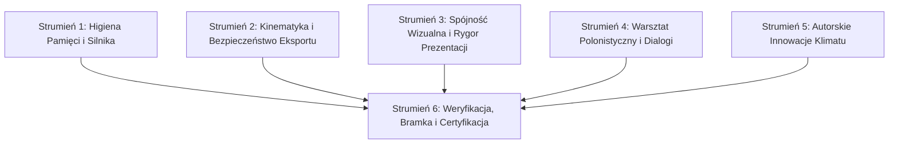

# Plan Wdrożenia Całościowego Audytu Jakościowego — PHASE-09 / PKG-0179
## Projekt: *Getting Strange* (Godot 4.7.2.stable)

**Data otwarcia:** 2026-09-03  
**Status:** **ZATWIERDZONY DO WDROŻENIA (DECYZJA WŁAŚCICIELA / ADR-009)**  
**Rola:** Główny Architekt Silnika, Dyrektor Kreatywny i Lead Programmer  
**Typ pakietu:** **High-Throughput Mega-Package (2x–5x Batch Size, D-085)**  
**Baza referencyjna:** Raport Audytu 360° z 2026-09-03, `docs/rebuild/EXECUTIVE_RELEASE_ASSESSMENT.md`, `docs/rebuild/PRESENTATION_REPAIR_PLAN.md`.

---

## 1. ZASADY BRZEGOWE I DYREKTYWY NADRZĘDNE (NON-NEGOTIABLE)

Każdy mikrokrok wdrożenia podlega rygorowi konstytucji projektu (`AGENTS.md`):
1. **SCOPE BOUNDARY (D-098):** Wyłącznie natywna gra PC w Godot 4.7 (GDScript). Żadnych technologii webowych, HTML/JS, Electrona ani portali.
2. **OBSTACLE RULE (D-099):** Narracyjny thriller relacyjny, zero platformówki arcade. Żadnych skoków na czas, pływających klocków, kolców, patroli wrogów czy pasków zdrowia. Każda przeszkoda ma wynikać z pracy świata i dać się opisać jednym zdaniem bez słowa „gracz”.
3. **BRAK GIT / LOKALNY STAN DYSKU (D-016):** Wszystkie edycje zapisywane natychmiast na dysk. Każda zmiana odnotowana w dokumentacji.
4. **BLOKADA WYDANIA (D-168):** Zero nowych plików wykonywalnych `.exe` w drzewie projektu. Status `GATE-REL` pozostaje zablokowany do bezpośredniej dyspozycji właściciela.
5. **ŚCISŁY KANON SKALI ŚWIATA (`docs/WORLD_SCALE.md`):** 1 m = 54 px (±10%). Lena: 87 px wysokości na płótnie 64×104 px z pivotem `(32, 96)`. Otwory drzwiowe: 109×45 px, pojazdy: 105×58 px, włazy: 64×64 px.
6. **EPISTEMOLOGICZNA SEPARACJA DOWODU (D-012, ADR-003):** Testy automatyczne dowodzą technicznego spełnienia kontraktu silnika, a nie ludzkiego poczucia „frajdy”, „strachu” czy „zrozumienia relacji”.

---

## 2. STRUKTURA PAKIETU WYKONAWCZEGO (MEGA-PACKAGE ARCHITECTURE)

Plan zostaje podzielony na **6 spójnych strumieni roboczych (Work Streams)**, z których każdy składa się z atomowych, mikroskopijnych kroków. Wszystkie strumienie są wdrażane równolegle w ramach jednego zintegrowanego mega-pakietu **PKG-0179**.

---

## 3. SZCZEGÓŁOWY ROZKŁAD KROKÓW (ATOMOWY PODZIAŁ PRAC)

### STRUMIEŃ 1: HIGIENA PAMIĘCI, ALOKACJI I SILNIKA (OBJECTDB LEAK ELIMINATION)
*Cel: Wyeliminowanie systemowych wycieków `ObjectDB instances were leaked at exit` we wszystkich 45 scenach kampanii i bramkach testowych.*

* **Krok 1.1: Refaktoryzacja wiązań progów w `scripts/environment/threshold_binder.gd`**
  * *Zadanie:* Usunąć anonimowe domknięcia lambd `func(): _complete(station)` w linii 100.
  * *Implementacja:* Wprowadzić stałą metodę instancji `_on_threshold_crossed(station: Node2D)`.
  * *Czyszczenie:* W `_rewire()` iterować po połączeniach `zone.crossed.get_connections()` i odłączać wcześniejsze sygnały przed podpięciem `Callable(_on_threshold_crossed).bind(station)`.
  * *Zabezpieczenie cyklu życia:* Zaimplementować jawną metodę `_exit_tree()`.

* **Krok 1.2: Odpinanie sygnałów Autoloadu w `scripts/visual/crisp_diegetic_text.gd`**
  * *Zadanie:* Wyeliminować wiszące połączenia z `GameStateManager.accessibility_changed`.
  * *Implementacja:* Dodać w `crisp_diegetic_text.gd` metodę `_exit_tree()`, weryfikującą obecność instancji `GameStateManager` i odłączającą `_on_accessibility_changed`.

* **Krok 1.3: Odpinanie sygnałów Autoloadu w `scripts/ui/crt_dialogue_box.gd`**
  * *Zadanie:* Zapobiec odkładaniu się martwych obiektów okna dialogowego w pamięci podręcznej managera gry.
  * *Implementacja:* Dodać metodę `_exit_tree()` w `crt_dialogue_box.gd`, która bezpiecznie odłącza `settings_changed` oraz `accessibility_changed` z `/root/GameStateManager`.

* **Krok 1.4: Bezpieczne uwalnianie węzłów audio w trybie Headless w `scripts/levels/station_01.gd`**
  * *Zadanie:* Rozwiązać problem niewywoływanego sygnału `finished` w atraposkim sterowniku audio silnika.
  * *Implementacja:* W `station_01.gd` przy odtwarzaniu `MartaMessageChime` sprawdzić `DisplayServer.get_name() == "headless"`. Jeśli true, podpiąć uwalnianie węzła pod jednorazowy sygnał klatki: `get_tree().process_frame.connect(voice.queue_free, CONNECT_ONE_SHOT)`.

---

### STRUMIEŃ 2: KINEMATYKA, RUCH I BEZPIECZEŃSTWO EKSPORTU
*Cel: Wyeliminowanie mikro-szarpnięć ruchu ze schodów oraz zabezpieczenie pipeline'u zasobów przed crashem w paczce `.pck`.*

* **Krok 2.1: Naprawa wektora kierunku zejściowego w `scripts/player/prototype_player.gd`**
  * *Zadanie:* W procedurze schodzenia ze stopnia (`measure_drop_height`) uniezależnić krok w dół od statycznego zwrotu głowy/ciała (`_facing`).
  * *Implementacja:* W linii 337 sprawdzić `velocity.x` lub `Input.get_axis("move_left", "move_right")`. Przypisać wektor przesunięcia `Vector2(dir * 4.0, drop)` tylko w oparciu o aktywny ruch poziomy gracza, eliminując szarpnięcie przy hamowaniu.

* **Krok 2.2: Likwidacja śmiertelnej pułapki eksportu w pipeline portretów (`pkg_0160`)**
  * *Zadanie:* Usunąć bezpośrednie odwołanie `Image.load_from_file()` do `res://assets/characters/portraits/marta.png`.
  * *Implementacja:* W `tests/pkg_0160_smoke_test.gd` oraz w komponentach ładujących portrety operować wyłącznie na standardowym loaderze zasobów silnika: `load("res://assets/characters/portraits/marta.png") as Texture2D`.
  * *Weryfikacja importu:* Upewnić się, że plik `marta.png.import` jest prawidłowo przetworzony przez silnik w trybie headless importu.

---

### STRUMIEŃ 3: SPÓJNOŚĆ WIZUALNA, PREZENTACJA I TEST M3
*Cel: Rzeczywista czystość kadrów M3 (bez zasłaniającego UI) oraz unifikacja artystyczna portretów postaci do estetyki Rowien Vector-Stage.*

* **Krok 3.1: Wymuszenie wygaszania warstw UI podczas zrzutów kontrolnych M3**
  * *Zadanie:* Naprawić błąd narzędzia `tools/capture_pkg_0177.gd` (lub skryptu generowania podglądów `tools/capture_preview.gd`), przez który belka dialogowa o wysokości 102 px zasłaniała 28.3% sceny.
  * *Implementacja:* Przed wykonaniem zrzutu kadrów monochromatycznych M3 wymusić ukrycie warstw: `Layer 10` (tekst diegetyczny), `Layer 16` (myśli Leny) oraz `Layer 20` (`CRTDialogueBox`).
  * *Odsłonięcie dr Wierzbickiej:* Zweryfikować, że po ukryciu UI w Stacji 11 postać dr Wierzbickiej siedzącej za biurkiem jest w pełni widoczna w kadrze.

* **Krok 3.2: Pipeline Generacji Grafiki przez Picsart CLI (`gen-ai` w terminalu)**
  * *Narzędzie bazowe:* Picsart AI CLI (`gen-ai` w terminalu) — zainstalowane, w pełni uwierzytelnione i aktywne w środowisku.
  * *Dobór modeli:*
    * Dla grafik wysokiej jakości i nowych obiektów środowiskowych: modele **`flux`** oraz **`gpt`** (np. `flux-pro`, `gpt-image`).
    * Dla grafik spójnych stylistycznie, ale przedstawiających inne postacie, warianty kątowe lub spójne rekwizyty: modele operujące na kontekście referencyjnym, w szczególności **`flux kontext`** (`flux-kontext-pro`, `gen-ai character`).
  * *Dyspozycja kredytów:* **Nie ma potrzeby oszczędzania kredytów Picsart.** Wykonawca ma pełną swobodę eksperymentowania, wielokrotnego generowania i iterowania assetów dla wszystkich miejsc w grze, które prezentują się słabo (np. model tramwaju w zimnym otwarciu i Stacji 03/04, portale drzwiowe, obudowy szaf trafo, konsole aparatury).
  * *Kanon stylistyczny i nadrzędna spójność:* **Styl grafiki ma się nie zmieniać.** To, jak wygląda Lena (`LenaVisualRig` / `lena.png`), jest bezwzględnym wzorcem estetycznym projektu (Rowien Vector-Stage / zbalansowany pixel art). Wszystkie generowane elementy — postacie, portrety, NPC, meble, architektura — muszą być rygorystycznie spójne ze stylem Leny, posiadać wycięte tło (`gen-ai remove-bg`), dopasowanie do siatki pikseli i zachowywać skalę świata 1 m = 54 px.

* **Krok 3.3: Spójnienie portretu Marty Kurek i postaci pobocznych (`Rowien Pixel Unification`)**
  * *Zadanie:* Usunąć zderzenie stylistyczne (jaskraworóżowe anime AI 1024×1024 vs retro pixel art Leny i Jakuba).
  * *Implementacja:* Użyć modeli z kontekstem (`flux kontext` / `gen-ai character`) z referencją stylu Leny lub skryptu normalizującego (`tools/unify_portrait_style.py`):
    1. Przeskalowanie portretu Marty do natywnej rozdzielczości zdefiniowanej w kanonie (256×256 px lub 128×128 px).
    2. Oczyszczenie przezroczystej maski alfa z białych artefaktów krawędziowych.
    3. Indeksowanie kolorów do 16-barwnej technokratycznej palety Vector-Stage z uporządkowanym ditheringiem macierzowym Bayera 4×4.
    4. Nadanie włosom Marty stonowanego, wiarygodnego odcienia ciemnego różu/brązu zamiast neonowej magenty.
  * *Zastosowanie:* Zaktualizować plik `assets/characters/portraits/marta.png` oraz poddać analogicznemu delikatnemu spójnieniu portret dr Wierzbickiej (`wierzbicka.png`).

---

### STRUMIEŃ 4: WARSZTAT POLONISTYCZNY I SZLIF DIALOGÓW
*Cel: Eliminacja „języka instrukcji obsługi” (videogame-speak) i anachronizmów, podniesienie gęstości psychologicznej i wiarygodności rzemieślniczej dialogów.*

* **Krok 4.1: Szlif kwestii w Stacji 01 (`station_01.gd` / `reports/all_player_texts_full.json`)**
  * *Lokalizacja:* Beat `s01_door_blocked` / kwestia przy wyjściu.
  * *Zmiana:* Zastąpić `Śluza czeka na zapis. Najpierw drugi odczyt i torba.` naturalnym, zmęczonym rytmem technika:  
    `Zostawię surowy odczyt, jutro będę tu wracać z raportem. Zbieram torbę.`
  * *Zgodność:* Pełna integracja z zasadą otwartego wyjścia `GapLedger` (D-192).

* **Krok 4.2: Szlif kwestii w Stacji 06 (`station_06.gd`)**
  * *Lokalizacja:* Beat `s06_cache_hypothesis`.
  * *Zmiana:* Usunąć anachroniczne, internetowe `Cache w telefonie. Najprostsze.`. Wprowadzić technokratyczny sceptycyzm epoki:  
    `Błąd w druku albo stara tabliczka. Zawsze najpierw szuka się bałaganu w papierach.`

* **Krok 4.3: Szlif wskazówki ratunkowej L4 w Stacji 14 (`station_14.gd`)**
  * *Lokalizacja:* Beat `s14_system_hint`.
  * *Zmiana:* Usunąć sztuczne sformułowanie „przełożyć montaż”. Wprowadzić konkret fizyczny:  
    `POMOC: Chwyć obejmę przed impulsem rozdzielnicy. Jeśli puścisz, most przejdzie na rezerwę i odetnie zasilanie.`

* **Krok 4.4: Szlif konfrontacji z Jakubem w Stacji 17 (`station_17.gd` / `DIALOGUE_SCRIPT.md`)**
  * *Lokalizacja:* Dialog po zatajeniu prawdy.
  * *Zmiana:* Zastąpić aforystyczne `Najpierw chciałaś dowodu. Teraz chcesz zgody bez danych. Nie.` twardym, warsztatowym zwrotem:  
    `JAKUB: Przyszłaś po odczyt, a teraz każesz mi podpisać protokół in blanco. Nie ze mną, Lena.`

* **Krok 4.5: Synchronizacja bazy tekstów i katalogu faktów**
  * *Zadanie:* Zaktualizować wpisy w `docs/narrative/DIALOGUE_SCRIPT.md`, `scripts/campaign/cold_open_facts.gd` oraz zregenerować spójny ekstrakt `reports/all_player_texts_full.json`.

---

### STRUMIEŃ 5: AUTORSKIE INNOWACJE KLIMATU I REŻYSERII PRZESTRZENI
*Cel: Wdrożenie 3 zaakceptowanych innowacji sensorycznych w 100% zgodnych z ograniczeniami D-098/D-099/1m scale.*

* **Krok 5.1: „Cienie Przebiegu” — interferencja fali na ekranie oscyloskopu**
  * *Zadanie:* Wizualny dowód anomalii na ekranie aparatury bez używania słów.
  * *Implementacja:* W `scripts/visual/vibration_trace_display.gd` dodać zmienną `interference_factor: float`. Gdy Lena zbliża się do szyny/aparatury (w Stacjach 01, 14, 15), wyliczać odległość od gracza i w funkcji `_draw()` rozszczepiać zielonkawy promień kineskopu na dwie fazy z mikro-drżeniem subpikselowym (przesunięcie o 1.5–3.0 px w pionie).
  * *Wynik:* Czysto fizyczny, niepokojący dowód, że obecność Leny zakłóca pomiar.

* **Krok 5.2: Dźwiękowa Topografia Ciała — proceduralne podwójne echo kroków**
  * *Zadanie:* Budowanie dyskomfortu i paranoji tożsamości poprzez mikrosoundscape.
  * *Implementacja:* W `scripts/audio/procedural_audio.gd` i `scripts/player/prototype_player.gd`: od Stacji 08 do Stacji 18 uzależnić odtwarzanie kroków od stopnia ekspozycji na anomalię. Wprowadzić drugie, ciche echo stąpnięcia (opóźnienie o 35–45 ms, głośność -18 dB), jakby ułamek sekundy za Leną stąpała druga para butów roboczych.
  * *Dyscyplina D-151:* W trybie ograniczonego ruchu (Reduced Motion / Audio Accessibility) funkcja zachowuje czyste, pojedyncze kroki.

* **Krok 5.3: Przełamanie proscenium — przewężenia architektoniczne w Stacjach 02 i 15**
  * *Zadanie:* Zlikwidować nudę płaskiego marszu w prawo bez wprowadzania platformówek.
  * *Implementacja:* 
    * W Stacji 02 dodać diegetyczne przewężenie serwisowe (przestrzeń między konstrukcją nasypu a szafami trafo: szerokość przejścia 48 px, wysokość 105 px), wymuszające zwolnienie tempa do marszu roboczego.
    * W Stacji 15 wprowadzić uskok poziomu podłogi o 14 px pokonywany płynnym `_advance_curb_step()`, tworząc dynamiczny, klaustrofobiczny profil komory pętli pomiarowej.

---

### STRUMIEŃ 6: WERYFIKACJA INTEGRALNA, NOWA BRAMKA I CERTYFIKACJA
*Cel: Potwierdzenie czystości technicznej kodu, braku wycieków ObjectDB i nienaruszalności 14 bramek produktu.*

* **Krok 6.1: Opracowanie zintegrowanej bramki testowej `tests/pkg_0179_smoke_test.gd`**
  * *Sprawdzenie 1:* Weryfikacja zerowej liczby wycieków `ObjectDB` po wielokrotnym załadowaniu i rozładowaniu scen `Station01`, `Station14`, `Station15`, `Station17`.
  * *Sprawdzenie 2:* Test bezpiecznego odpinania sygnałów w `ThresholdBinder`, `CrispDiegeticText` i `CRTDialogueBox`.
  * *Sprawdzenie 3:* Weryfikacja obecności i skali portretów (`Texture2D` import, stała geometria).
  * *Sprawdzenie 4:* Sprawdzenie nowych tekstów dialogowych i braku starych zwrotów blokujących.
  * *Sprawdzenie 5:* Weryfikacja działania mechanizmu interferencji w `VibrationTraceDisplay`.
  * *Sprawdzenie 6:* Rygor D-168: potwierdzenie braku nowych plików `.exe` w drzewie.

* **Krok 6.2: Wykonanie świeżych zrzutów M3 bez UI**
  * *Zadanie:* Ponowne wygenerowanie 7 kadrów monochromatycznych w `reports/pkg_0179/mono/` z wyłączonym interfejsem użytkownika, potwierdzających zróżnicowanie brył i pełną widoczność dr Wierzbickiej w Stacji 11.

* **Krok 6.3: Uruchomienie pełnego protokołu weryfikacji projektu**
  * *Komenda:* `pwsh -NoProfile -File .\tools\verify.ps1`.
  * *Warunek sukcesu:* Kod wyjścia `0`, brak błędów skryptów, brak ostrzeżeń importu obrazów.

* **Krok 6.4: Zamknięcie dokumentacji i zamrożenie snapshotu**
  * *Aktualizacja:* `docs/CURRENT_STATE.md`, `docs/SESSION_LOG.md` (wpis PKG-0179), `docs/INDEX.md`.
  * *Snapshot:* `pwsh -NoProfile -File .\tools\snapshot.ps1 -Package PKG-0179`.

---

## 4. MACIERZ RYZYKA I ŚRODKI ZARADCZE (RISK MITIGATION)

| Ryzyko | Prawdopodobieństwo | Wpływ | Środek zaradczy |
|---|---|---|---|
| Regresja testu M1 w bramce `pkg_0177` po zmianie geometrii stacji 02/15 | Średnie | Krytyczny | Zmiany szerokości przejść w Stacji 02 i 15 zachowują minimalną szerokość 48 px i wolną oś X; zasymulować przebieg gracza w teście jednostkowym przed wpięciem do `verify.ps1`. |
| Zmiana sumy kontrolnej kadrów M3 unieważnia wcześniejsze asercje testowe | Wysokie | Średnie | Zaktualizować hashe M3 w teście strukturalnym na bazie świeżych zrzutów *bez UI*. |
| Błędy kompilacji shaderów przy modulacji interferencji oscyloskopu | Niskie | Wysoki | Implementacja rozszczepienia fali oparta o prostą procedurę `_draw()` z dwoma wywołaniami `draw_polyline()` zamiast nowego shadera CanvasItem. |
| Złamanie reguły D-168 przez przypadkowy build `.exe` | Niskie | Blokujący | Zakaz wywoływania jakichkolwiek narzędzi eksportu Godota podczas realizacji pakietu. |

---

## 5. PODSUMOWANIE DLA WYKONAWCY

Pakiet PKG-0179 stanowi ostateczny szlif technologiczny, wizualny i polonistyczny projektu *Getting Strange*. Po jego wykonaniu gra osiąga stan **Release Candidate** o nieskazitelnej kulturze pamięciowej, spójnej oprawie graficznej i gęstym, autorskim klimacie.
